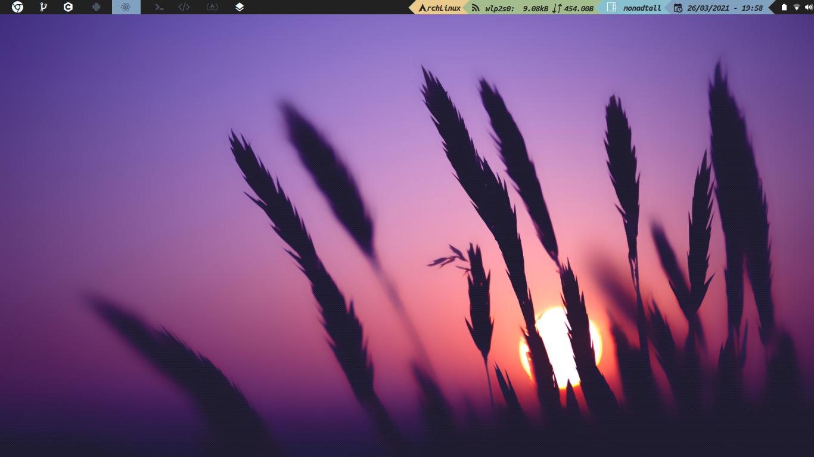

# Configuración de Qtile



***Idioma***
- [Español](./README.es.md)
- Inglés

## Instalación (basado en Arch)

Instala Qtile y sus dependencias:

```
sudo pacman -S qtile pacman-contrib
yay -S nerd-fonts-ubuntu-mono
pip install psutil
```

Clona este repositorio y copia mis configuraciones:

```bash
git clone https://github.com/Alex108-lab/Qtile-config.git
cp -r Qtile-config/qtile ~/.config/
```

Pruébalo con **[Xephyr](https://wiki.archlinux.org/index.php/Xephyr)**:

```bash
Xephyr -br -ac -noreset -screen 1280x720 :1 &
DISPLAY=:1 qtile
```

Si el widget de red no funciona, revisa ```./settings/widgets.py``` y busca
esta línea, deberías encontrarla dentro de una lista llamada *primary_widgets*:

```python
# Change interface arg, use ip address to find which one you need
 widget.Net(**base(bg='color3'), interface='wlp2s0'),
```

## Estructura

En ```config.py```, que es el archivo donde la mayoría escribe toda su configuración,
solo tengo una función *autostart* y algunas otras variables como
*cursor_warp*.

```python
@hook.subscribe.startup_once
def autostart():
    subprocess.call([path.join(qtile_path, 'autostart.sh')])
```

Si deseas cambiar los programas de *autostart*, abre  ```./autostart.sh```.

```bash
#!/bin/sh

# systray battery icon
cbatticon -u 5 &
# systray volume
volumeicon &
```

Si deseas modificar los atajos de teclado, abre ```./settings/keys.py```. Para modificar
los espacios de trabajo, usa ```./settings/groups.py```. Finalmente, si deseas agregar más
disposiciones (layouts), revisa ```./settings/layouts.py```, el resto de los archivos no necesita ninguna
configuración.

## Temas

Para establecer un tema, verifica cuáles están disponibles en ```./themes```, y escribe
el nombre del tema que deseas en un archivo llamado ```./config.json```:

```json
{
    "theme": "material-ocean"
}
