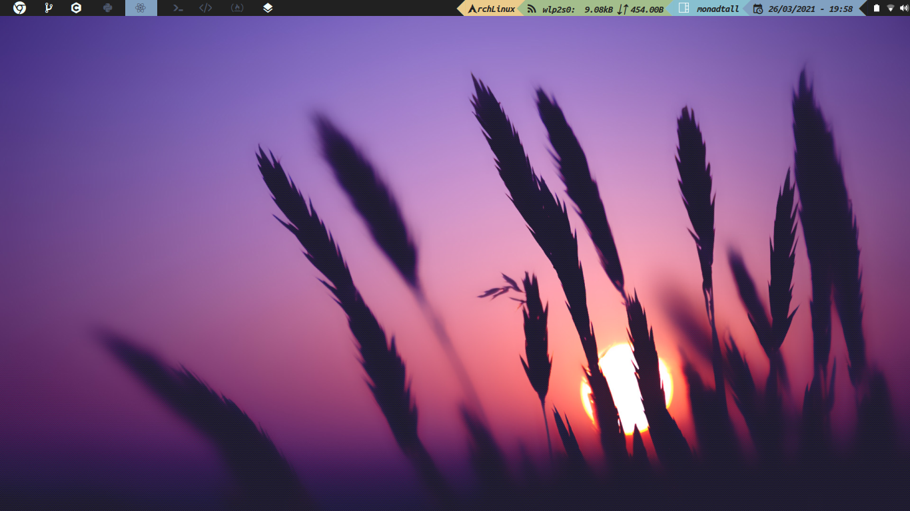

# Qtile-config



**_Idioma_**

- Español
- [English](./README.en.md)

## Instalación (Arch)

Instala Qtile y las dependencias:

```bash
sudo pacman -S qtile pacman-contrib
yay -S nerd-fonts-ubuntu-mono
pip install psutil
```

Clona este repositorio o tambien descargalo en zip y copia mis configuraciones:

```bash
git clone https://github.com/Alex108-lab/Qtile-config.git
cp -r Qtile-config/qtile ~/.config/
```

Si el icono de la red no funciona, abre `./settings/widgets.py` y busca esta
línea, debería estar dentro de una lista llamada _primary_widgets_:

```python
# Cambia el argumento "interface", usa ip address o ip link para saber cuál poner
 widget.Net(**base(bg='color3'), interface='wlp2s0'),
```

## Estructura

En el archivo `config.py` que es donde la mayoría suele poner toda su
configuración, yo solo tengo el _autostart_ y algunas variables como
_cursor_warp_.

```python
@hook.subscribe.startup_once
def autostart():
    subprocess.call([path.join(qtile_path, 'autostart.sh')])
```

Para cambiar lo que se lanza en el _autostart_ abre el archivo `./autostart.sh`.

```bash
#!/bin/sh

# systray battery icon
cbatticon -u 5 &

# systray volume
volumeicon &

# wifi icon
nm-applet &

# pamac-tray &
```

Si quieres añadir o quitar atajos de teclado, abre `./settings/keys.py`. Para
añadir o quitar espacios de trabajos, debes modificar `./settings/groups.py`.
Finalmente, si quieres añadir nuevos _layouts_, abre `./settings/layouts.py`, el
resto de archivos no hace falta tocarlos.

## Temas

Para establecer un tema, mira los que hay disponibles en `./themes`, y coloca su
nombre en un archivo llamado `./config.json`:

```json
{
  "theme": "material-ocean"
}
```

## Ventanas

| Atajo                   | Acción                                       |
| ----------------------- | -------------------------------------------- |
| **mod + j**             | siguiente ventana                            |
| **mod + k**             | ventana previa                               |
| **mod + shift + h**     | aumentar master                              |
| **mod + shift + l**     | decrementar master                           |
| **mod + shift + j**     | mover ventana abajo                          |
| **mod + shift + k**     | mover ventana arriba                         |
| **mod + shift + f**     | pasar ventana a flotante                     |
| **mod + tab**           | cambiar la disposición de las ventanas       |
| **mod + [1-9]**         | cambiar al espacio de trabajo N (1-9)        |
| **mod + shift + [1-9]** | mandar ventana al espacio de trabajo N (1-9) |
| **mod + punto**         | enfocar siguiente monitor                    |
| **mod + coma**          | enfocar monitor previo                       |
| **mod + w**             | cerrar ventana                               |
| **mod + ctrl + r**      | reiniciar gestor de ventana                  |
| **mod + ctrl + q**      | cerrar sesión                                |

Los siguientes atajos de teclado funcionarán solo si instalas los programas:

```bash
sudo pacman -S rofi thunar chromium alacritty termite redshift scrot
```

## Apps

| Atajo               | Acción                                 |
| ------------------- | -------------------------------------- |
| **mod + m**         | lanzar rofi                            |
| **mod + shift + m** | navegación (rofi)                      |
| **mod + b**         | lanzar navegador (chromium)            |
| **mod + shift + b** | lanzar navegador (firefox)             |
| **mod + e**         | lanzar explorador de archivos (thunar) |
| **mod + return**    | lanzar terminal (alacritty)            |
| **mod + r**         | redshift                               |
| **mod + shift + r** | detener redshift                       |
| **mod + s**         | captura de pantalla (scrot)            |

# Software

## Utilidades básicas

| Software                                                                                            | Utilidad                                      |
| --------------------------------------------------------------------------------------------------- | --------------------------------------------- |
| **[networkmanager](https://wiki.archlinux.org/index.php/NetworkManager)**                           | Autoexplicativo                               |
| **[network-manager-applet](https://wiki.archlinux.org/index.php/NetworkManager#nm-applet)**         | _NetworkManager_ systray                      |
| **[pulseaudio](https://wiki.archlinux.org/index.php/PulseAudio)**                                   | Autoexplicativo                               |
| **[pavucontrol](https://www.archlinux.org/packages/extra/x86_64/pavucontrol/)**                     | _pulseaudio_ GUI                              |
| **[pamixer](https://www.archlinux.org/packages/community/x86_64/pamixer/)**                         | _pulseaudio_ CLI                              |
| **[brightnessctl](https://www.archlinux.org/packages/community/x86_64/brightnessctl/)**             | Brillo para portátiles                        |
| **[xinit](https://wiki.archlinux.org/index.php/Xinit)**                                             | Inicia programas antes del gestor de ventanas |
| **[libnotify](https://wiki.archlinux.org/index.php/Desktop_notifications)**                         | Notificaciones de escritorio                  |
| **[notification-daemon](https://www.archlinux.org/packages/community/x86_64/notification-daemon/)** | Autoexplicativo                               |
| **[udiskie](https://www.archlinux.org/packages/community/any/udiskie/)**                            | Montar discos automáticamente                 |
| **[ntfs-3g](https://wiki.archlinux.org/index.php/NTFS-3G)**                                         | Leer y escribir NTFS                          |
| **[arandr](https://www.archlinux.org/packages/community/any/arandr/)**                              | GUI para _xrandr_                             |
| **[cbatticon](https://www.archlinux.org/packages/community/x86_64/cbatticon/)**                     | Systray para la batería                       |
| **[volumeicon](https://www.archlinux.org/packages/community/x86_64/volumeicon/)**                   | Systray para el volumen                       |
| **[glib2](https://www.archlinux.org/packages/core/x86_64/glib2/)**                                  | Basura                                        |
| **[gvfs](https://www.archlinux.org/packages/extra/x86_64/gvfs/)**                                   | Basura para GUIs                              |

## Fuentes, temas y GTK

| Software                                                                               | Utilidad                               |
| -------------------------------------------------------------------------------------- | -------------------------------------- |
| **[Picom](https://wiki.archlinux.org/index.php/Picom)**                                | Compositor para Xorg                   |
| **[UbuntuMono Nerd Font](https://aur.archlinux.org/packages/nerd-fonts-ubuntu-mono/)** | Nerd Font para iconos                  |
| **[Material Black](https://www.gnome-look.org/p/1316887/)**                            | Tema e iconos para GTK                 |
| **[lxappearance](https://www.archlinux.org/packages/community/x86_64/lxappearance/)**  | GUI para cambiar temas                 |
| **[nitrogen](https://wiki.archlinux.org/index.php/Nitrogen)**                          | GUI para establecer fondos de pantalla |
| **[feh](https://wiki.archlinux.org/index.php/Feh)**                                    | CLI para establecer fondos de pantalla |

## Apps

| Software                                                              | Utilidad                           |
| --------------------------------------------------------------------- | ---------------------------------- |
| **[alacritty](https://wiki.archlinux.org/index.php/Alacritty)**       | Emulador de Terminal               |
| **[termite](https://wiki.archlinux.org/index.php/termite)**           | Emulador de Terminal               |
| **[thunar](https://wiki.archlinux.org/index.php/Thunar)**             | Gestor de archivos gráfico         |
| **[ranger](https://wiki.archlinux.org/index.php/Ranger)**             | Gestor de archivos de terminal     |
| **[neovim](https://wiki.archlinux.org/index.php/Neovim)**             | Editor de texto basado en terminal |
| **[rofi](https://wiki.archlinux.org/index.php/Rofi)**                 | Menú y navegación                  |
| **[scrot](https://wiki.archlinux.org/index.php/Screen_capture)**      | Captura de pantalla                |
| **[redshift](https://wiki.archlinux.org/index.php/Redshift)**         | Modo nocturno                      |
| **[trayer](https://www.archlinux.org/packages/extra/x86_64/trayer/)** | Systray                            |
