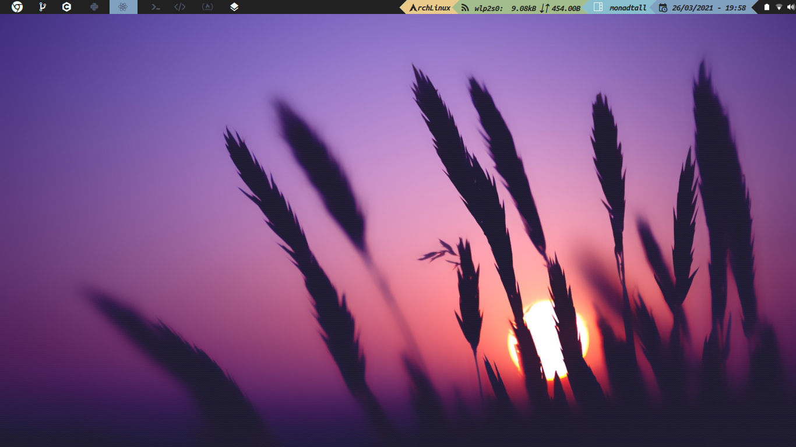

# Qtile-config




***Idioma***
- 🇪🇸 Español
- [🇺🇸 English](./README.en.md)

## Instalación (Arch)

Instala Qtile y las dependencias:

```bash
sudo pacman -S qtile pacman-contrib
yay -S nerd-fonts-ubuntu-mono
pip install psutil
```

Clona este repositorio y copia mis configuraciones:

```bash
git clone https://github.com/Alex108-lab/Qtile-config.git
cp -r Qtile-config/qtile ~/.config/
```

Si el icono de la red no funciona, abre  ```./settings/widgets.py``` y busca
esta línea, debería estar dentro de una lista llamada *primary_widgets*:

```python
# Cambia el argumento "interface", usa ip address o ip link para saber cuál poner
 widget.Net(**base(bg='color3'), interface='wlp2s0'),
```

Una vez eso está hecho, puedes iniciar sesion, para que los atajos de teclado funcionen mira
[esta sección]
para las instrucciones.

## Estructura

En el archivo ```config.py``` que es donde la mayoría suele poner toda su
configuración, yo solo tengo el *autostart* y algunas variables como
*cursor_warp*.

```python
@hook.subscribe.startup_once
def autostart():
    subprocess.call([path.join(qtile_path, 'autostart.sh')])
```

Para cambiar lo que se lanza en el *autostart* abre el archivo 
```./autostart.sh```.

```bash
#!/bin/sh

# systray battery icon
cbatticon -u 5 &

# systray volume
volumeicon &

# wifi icon
nm-applet &

# pamac-tray &
```

Si quieres añadir o quitar atajos de teclado, abre ```./settings/keys.py```.
Para añadir o quitar espacios de trabajos, debes modificar
```./settings/groups.py```. Finalmente, si quieres añadir nuevos *layouts*,
abre ```./settings/layouts.py```, el resto de archivos no hace falta tocarlos.

## Temas

Para establecer un tema, mira los que hay disponibles en ```./themes```, y
coloca su nombre en un archivo llamado ```./config.json```:

```json
{
    "theme": "material-ocean"
}
```
